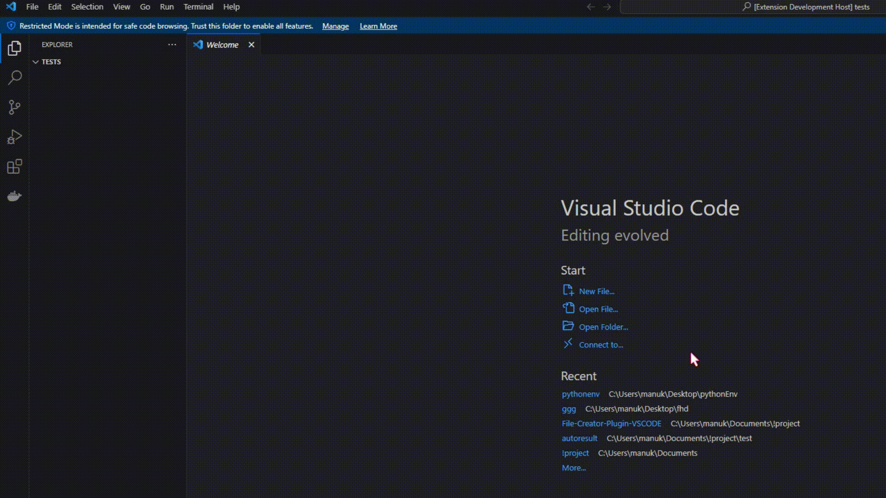

## Python venv

## Использование
Откройте в Visual Studio Code рабочую папку.
Запустите debug сщчетанием клавиш Ctrl+Shift+D либо F5.
Вызовите командную палитру, нажав клавиши Ctrl+Shift+P (Windows/Linux) или Cmd+Shift+P (Mac).

## Пример
Используя команду "Create venv" создаться не только виртуальное окружение, но и кастомный файл main.py и .gitignore

## Заключение
Расширение упрощает жизнь разработчикам, которые не пользуются специальными ide, которые сами создают виртуальное окружение.

## Автор 
Моклякова Мария M3116
